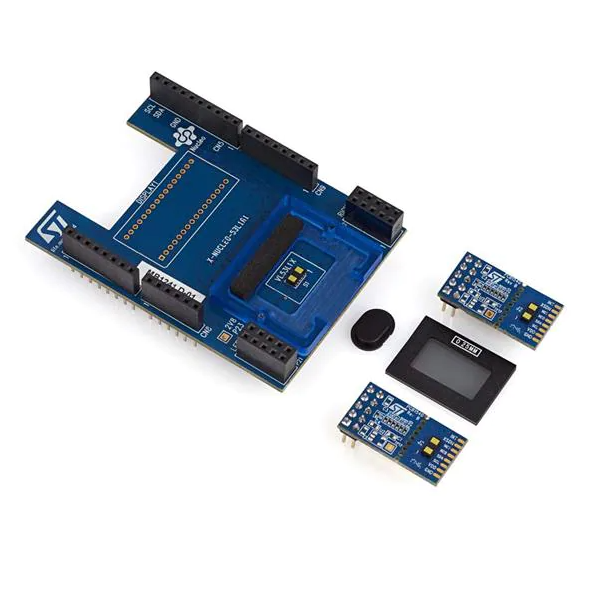
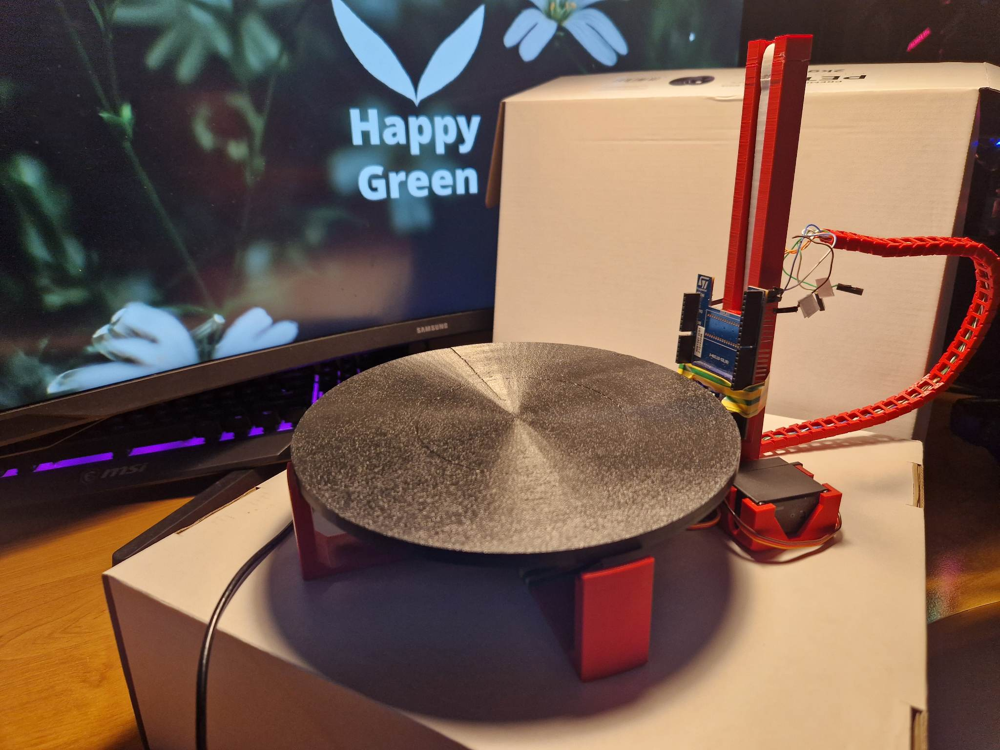
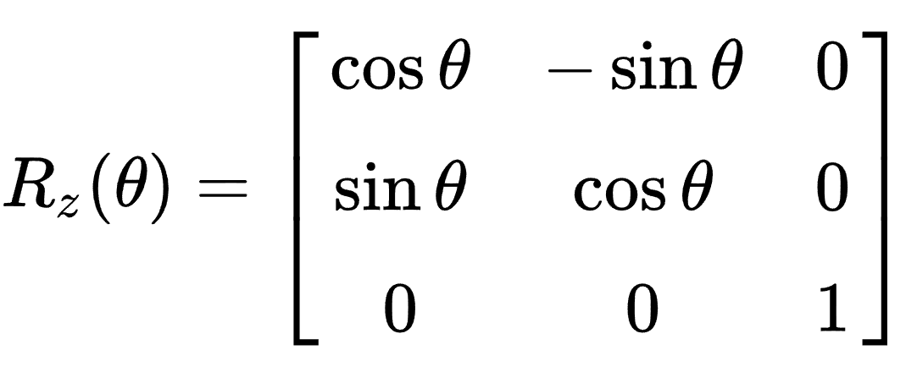
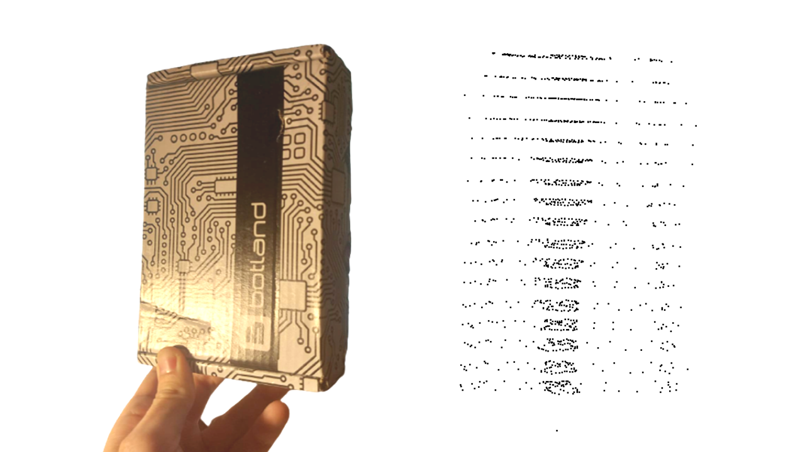

## Hierarchia folderów:
**user_lib** - aplikacja skanera

**vl53l1x_driver** - sterownik do VL53L1X

**pwmServoDriver** - sterownik do serw 360

**CAD_files** - Modele części składowych urządzenia

# Projekt z przedmiotu SWIS

Celem projektu było stworzenie modelu koncepcyjnego skanera objektów trójwymiarowych z wykorzystaniem czujnika odległości ToF VL53L1X rodziny ST. W przypadku projektu posłużono się płytą rozszerzeniową 53L1A1 do obsługi 3 czujników ToF.

W ramach projektu skupiono się na stworzeniu koncepcji samego skanera i jego konstrukcji, napisaniu sterowników do obsługi dwóch serw oraz możliwości obsługi trzech czujników ToF oraz napisaniu programu do operowania urządzeniem i wczytywania danych. Do wizualizacji chmury punktów obiektu w przestrzeni wykorzystano program CloudCompare (https://github.com/CloudCompare).

#  Opis urządzenia

#  Sterowniki
## VL53L1X

Na stronie https://elixir.bootlin.com/ można znaleźć sterownik do VL53L0X. Niestety różni się mapą rejestrów z VL53L1X. Zdecydowano odwołać się do przykładowego sterownika typu misc zaproponowanego przez STMicroelectronics. (https://www.st.com/en/embedded-software/stsw-img013.html) Jest to przykład sterownika, który nie obsługuje samego urządzenia, tylko jego PIN przerwaniowy, na stałe wpisany przez użytkownika. W naszym przypadku został stworzony sterownik typu character device tworzony jako `/dev/`, komunikujący się za pomocą i2c. Kolejnym ważnym elementem którego zabrakło w przykładzie ST był brak obsługi urządzenia (otwieranie, wczytywanie i zapisywanie), bądź obsługa kilku urządzeń tej samej klasy. Dodano więc elementy nadawania numerów MAJOR i MINOR dla urządzeń oraz zaimplementowano prostą obsługę inicjalizacji urządzenia, jego otwierania i zwalniania, bądź obsługi read/write i przerwań.

## servoDriver

Należało się skupić nad możliwością konfiguracji serw z poziomu drzewa urządzeń. Taka koncepcja znacznie bardziej ujednolica konfigurację serw PWM, szczególnie w przypadku wykorzystania różnych rodzajów tego elementu, gdyż każdy z nich może mieć inny poziom wyzwalania kierunku oraz szybkości obrotu. W tym przypadku również odwołano się do sterownika urządzeń typu char, generowanego jako urządzenie `/proc/`. Komunikacja między tego typu urządzeniami może być łatwo zaimplementowana przez polecenia `bash`. Stworzono 3 tryby operowania: SLOW(1), FAST(2) oraz STOP(0). Serwa odpowiednio się obracają dla tych poleceń, na podstawie otrzymywanych w funkcji probe parametrów z device tree. Sterownik obecnie jest zdefiniowany dla dwóch instancji serw.

## Aplikacja

W aplikacji posłużono się dostarczanym przez ST API. Zdefiniowaliśmy swoje funkcje (nadpisaliśmy) specyficzne dla platformy (Linux), żeby api wywoływało inicjalizację VL53L1X oraz obsługiwało komunikację, bądź zgłoszenia urządzenia przez przerwania poprzez kernel. Następnie osobno zdefiniowano obsługę serw za pomocą poleceń `bash`, wywoływanych w aplikacji. Kolejność obsługi urządzeń została rozwiązana za pomocą wykorzystania mutexa i wątku.

### Sposób działania skanera (aplikacji)
1. Inicjalizowane są maksymalnie 3 czujniki VL53L1X. (W projekcie używamy jednego, ze względu na zbyt duże odstępy między czujnikami na płytce 53L1A1).
2. Tworzony jest wątek obsłi serw (`handler`).
3. Wykonywany jest wstępny obrót stolika skanera (Zajmowany i zwalniany mutex, VL53L1X czeka).
4. Wykonywany jest wstępny róch do góry (Zajmowany i zwalniany mutex, VL53L1X czeka).

W kolejnych itercjach jest powtarzany algorytm:

1. VL53L1X zajmuje mutex i razem z ruchem obrotu stolika skanera wykonuje się pomiar (80 pomiarów na obrót).
2. Gdy stolik kończy obrót wywoływane jest polecenie przesunięcia serwa z czujnikiem VL53L1X do góry (jak mutex nie jest zwolniony, to nie przesuwa, czeka).
3. Jak tylko skończy się ostatni pomiar VL53L1X, serwo ruchu do góry przejmuje mutex, a VL53L1X czeka na ten mutex.
4. Servo ruchu do góry zwalnia mutex, powtarza się punkt 1.

### Algorytm przetwarzania odległości na punkty w przestrzeni
W ramach algorytmu do wyznaczenia położenia wykorzystano macierz rotacji. Przekazujemy zmierzony dystans (r) z czujnika oraz kąt obrotu (θ). Używając macierzy rotacji względem osi Z:

otrzymujemy współrzędne X i Y. Z zaś wyznaczamy jako stosunek całej drogi do góry przez liczbę przesunięć czujnika razy numer przesunięcia.

# Wynik
Otrzymano następujący zeskanowany kształt.

Widać wyraźnie, że z powodu dużego przesunięcia w osi Z jest gubiona duża liczba próbek, aczkolwiek wiązałoby się to z bardzo długim czasem pomiaru. Aczkolwiek można zauważyć podobieństwo kształtu. Jakość pomiaru można też spróbować usprawnić zwiększając rozdzielczość matrycy SPAD czy próbując użyć kilku czujników VL53L1X czy też próbując zwiększyć próbkowanie.